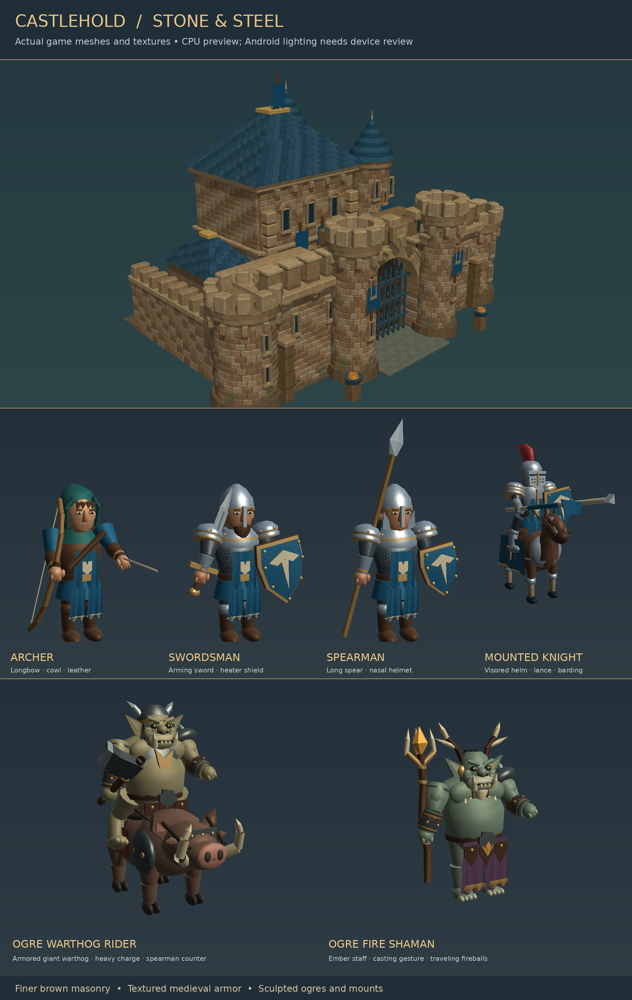

# Castlehold — Stone & Steel 0.5.0

Warmer, finer castle masonry, textured medieval armor and cloth, and more detailed ogre faces and bodies improve the existing 3D cast. **Attackers deal 12% more damage**, including charges and boss specials. Defeated men give a short oof; orcs and ogres have distinct rough grunts. Three original synthesized variations per faction play through the adjustable Sound effects level, through a fixed four-channel voice pool so several nearby deaths can be heard without unbounded stacking.

Boss bounties and wave income increase to fund replacements after stronger attacks. Boss encounters now arrive every 20 waves at **20, 40, 60, 80 and 100**. This complete source package includes nonstop assaults, persistent troops, full pause/recruitment, finger scouting and original medieval music at an adjustable **35%** default.



The image inspects actual project geometry with approximate lighting. It is not an Android gameplay screenshot. See `docs/GRAPHICS_AND_SOUND_UPDATE.md`, `docs/CASTLE_OVERHAUL_0.4.4.md` and `docs/VALIDATION.md` for the changes and remaining device review.

## 0.5.0 — Bantam Entertainment branding

- Adds the approved **Bantam Entertainment** red/black/gold studio logo with **no domain name**.
- Castlehold now boots through a solid-black studio splash before the battle scene.
- The red/gold loading bar is **functional**: it is driven by Godot threaded loading status rather than being baked into artwork.
- A short minimum display window keeps the studio mark readable on fast devices, while actual load completion still gates the scene transition.
- The same approved logo is configured as the native Godot boot splash to avoid an unbranded first frame.
- All 0.4.9 combat, atmosphere, 120-wave finale, save/pause and 1×–4× speed systems remain intact.

## 0.4.9 — Impact & Atmosphere

- Combat feedback now distinguishes **body, armor and skeletal impacts** with dedicated pooled VFX palettes and **13 new original synthesized impact/footstep sounds**. Heavy blows use their own low-end impact layer.
- Boss, ogre, charge and structure hits now drive a restrained **distance-aware camera trauma system**. Camera feedback decays in real time so 4× mode does not become a vibrating blur.
- Units start idle loops at varied phases, receive tiny silhouette-scale variation, use faster attack/hit blends, and get a brief geometry squash/recovery on impacts so crowds feel less synchronized and mannequin-like.
- The fixed VFX pool expands from 96 to **112 slots**, adding 16 opaque metallic impact streaks while retaining the anti-flash dust reset and no-allocation combat rule.
- The battlefield sidelines gain **broken siege carts, abandoned stake lines and rock clusters** to make the valley feel fought-over without obstructing the combat lane or adding animated scenery cost.
- GitHub Actions now runs `tests/premium_combat.gd` alongside the existing graphics, anti-flash, boss, endurance and finale/save regressions.
- Android version code is **18**. The 120-wave Gravecaller finale, Victory fanfare, Save/Continue and 1×–4× controls remain intact.

## 0.4.8 — Final Victory / 4× / Save for Later

- Wave 120 is now explicitly treated as one **final boss encounter**: The Gravecaller plus his surviving army. Killing the necromancer alone does not end the game. Victory is awarded only after the reinforcement queue is empty and **every remaining enemy is defeated**.
- The HUD keeps a **FINAL BOSS • GRAVECALLER'S LEGION** panel visible after the necromancer falls so the encounter still reads as one finale.
- Final victory displays **VICTORY** and plays a new dedicated **5.2-second synthesized triumphant fanfare** on its own effects player so ordinary combat sounds cannot steal its audio slot.
- Battle speed now cycles **1× / 2× / 3× / 4×**, including while paused. The selected speed persists in saves.
- A top-bar **Save** button pauses first and writes the current campaign state for later continuation without replacing the in-session Retry Wave checkpoint. Android backgrounding also writes the current live state when possible. Reopening a saved battle restores it paused.
- Android version code is **17**. CI adds `tests/finale_and_save.gd` covering final-boss completion, fanfare availability, 4× persistence and manual save/continue behavior.

## 0.4.7 — Gravecaller / 120-wave finale

- The continuous siege now runs **120 waves** instead of 100.
- Existing bosses remain at waves **20, 40, 60, 80 and 100**; wave **120** introduces **The Gravecaller**, a giant ogre necromancer.
- The Gravecaller walks into the battlefield before casting **RAISE THE DEAD**. At four health thresholds he can raise up to **12 articulated ogre skeletons per ritual** directly from the ground around him.
- Raised ogres use a new skeletal 3D model with exposed ribs, skull, pelvis, heavy limb bones, armor scraps and their own animated weapon. They are not recolored living-ogre meshes.
- The final necromancy event respects the same **84-enemy mobile performance cap**, uses a green ritual VFX palette and an original synthesized necromancy cue.
- Completed 0.4.6 wave-100 saves are recognized and resume at the planning gap before wave 101.

## 0.4.6 — Android Anti-Flash Pass

- The battlefield sun now uses one **orthogonal directional shadow map** instead of two blended shadow cascades, removing split handoffs that can briefly change scene brightness on mobile GPUs.
- Dynamic shadow range is tightened to the playable field, with a smaller shadow pancake and no distance fade band inside the battle. Decorative ridges, trees, bushes, grass and the ground no longer waste shadow-caster work.
- Unit contact shadows are lifted farther from the terrain and use depth-prepass transparency to reduce depth fighting and sorting artifacts.
- Recycled dust is reset before being shown, peak dust/spark opacity is slightly reduced, flame shells use an alpha depth prepass, and boss warning rings are now translucent rather than fully opaque.
- Android version code is **15**. Gameplay, boss cadence, saves, balance, speed control and audio are unchanged. CI includes a dedicated `anti_flash.gd` regression test.

## 0.4.5 — Bosses Every 20 Waves

- Boss milestones move to **20 / 40 / 60 / 80 / 100** instead of 25 / 50 / 75 / 100.
- Gatebreaker now arrives at 20, Dreadscale Rider at 40, Ashcaller at 60, the new **Stone-Eye Warlord** at 80, and Ironjaw King remains the final boss at 100.
- Stone-Eye is a tougher late-game cyclops variant using the authored Gatebreaker rig with increased HP, armor, splash and an **EARTHSHATTER** special.
- Android version code is 14. Existing version-two saves remain valid; boss milestones already passed in an old checkpoint are not replayed retroactively.

## 0.4.4 — Castle overhaul

- The castle silhouette is pushed much harder with a **larger keep**, **taller watchtower**, **chunkier gatehouse**, **bigger front towers**, **twin roof turrets** and stronger vertical emphasis.
- The gatehouse gains a central watch chamber and heavier front buttresses, while the keep gains more height, a broader roof, extra banners and a more dramatic medieval skyline.
- Side corner towers are larger and roofed, giving the fortress a more heroic PS2-era strategy-game read from the battle camera.

## 0.4.3 — Castle polish

- The castle silhouette is upgraded with **machicolation shelves**, stronger gatehouse overhangs, a more decorated keep frontage, corner quoins, buttresses, a roof dormer, chimneys and extra tower detailing.
- Rampart walls gain under-parapet stone supports, and the mage tower receives a brazier plus extra crown detail for a richer skyline.
- Android version code is 12. Gameplay balance, speed control, checkpoints and louder character voices remain the 0.4.2 baseline.

## 0.4.2 — Speed & Voices

- New top-bar **1× / 2× / 3×** battle-speed button. It works during combat and while paused, persists in checkpoints, and resets the engine safely when Castlehold closes.
- Defeat voices now use a fixed **four-channel** pool instead of two channels, with louder human/orc/ogre mixes and speed-aware anti-spam timing so deaths remain audible at 2× and 3×.
- Android version code is 11. CI now runs a dedicated battle-speed regression test in addition to the existing audio and gameplay checks.

## Play

- The first assault begins after a four-second countdown. No BEGIN WAVE button or preparation rounds.
- Reinforcements arrive over **10–15 seconds**, followed by a **3–5 second gap** before the next wave. Existing enemies keep fighting throughout.
- Recruit Archers, Swordsmen, Spearmen and mounted Knights using the bottom cards. Buy replacements or repair the Gate/Keep at any time, including while paused.
- **1× / 2× / 3× / 4×** changes the entire battle simulation speed while keeping movement, projectiles, combat timers and animations synchronized. The choice is checkpointed.
- **Pause / Resume** freezes and resumes the wave clock, movement, arrows, fireballs and animations. **Save** pauses and stores the current campaign state for later continuation. Switching away from the app also pauses, saves the live state when possible, and suspends audio. Returning restores music; tap Resume when ready to fight.
- **Settings** provides Music and Sound effects sliders, a Mute all audio switch, and Test effects. Changes apply immediately and save automatically. The battle pauses while Settings is open; music continues so you can hear your adjustments. Closing Settings or Credits restores the previous pause state.
- Drag empty ground to scout approaching enemies. Tap **Castle** to return home.
- Surviving soldiers heal when the next wave starts. Their positions and combat continue; defeated troops stay lost. Castle damage persists.
- At wave 120, the Gravecaller and his entire surviving force count as one final boss encounter. The Gravecaller can fall first, but **VICTORY** appears only after every remaining attacker is defeated. If the Keep falls, **Retry Wave** restores the latest wave checkpoint and pauses so you can plan.

Defenders carry visible longbows, swords, heraldic shields, long spears and mounted lances. Enemies have broad jaws, tusks, pointed ears, rough iron and patched rust cloth. Ironshields resist arrows; meet them with swords. Spearmen counter wargs. Knights pursue hunters and shamans along the wings, and archers focus on ogres threatening the gate. Fire shamans first appear at wave 18; warthog riders arrive at wave 25. Their fireballs hit on arrival, with a small blast that damages at most two secondary defenders. The castle uses smaller sandstone courses, beveled blocks, shaped radial turret masonry, larger towers, a layered keep skyline, a heavy arched gatehouse and a destructible timber gate/portcullis.

## Fresh install from a phone

Download **Castlehold-Fresh-Install.zip**. Create a new GitHub repository, such as **Castlehold-Fresh**, with **Add a README file** enabled. Upload the ZIP to the repository root, then open a Codespace for that repository and paste:

```bash
git pull --ff-only &&
unzip -o Castlehold-Fresh-Install.zip &&
git add project tests docs tools .github README.md FRESH_INSTALL.md GDD.md CHARACTER_ART_BIBLE.md BALANCE.md ANDROID_BUILD.md ASSET_LICENSES.md .gitignore &&
git commit -m "Install complete Castlehold game" &&
git push
```

This archive contains every source file and game asset, including the Android workflow, directly at repository root. Earlier installs and update archives are not required. GitHub Actions imports the game, runs its checks and builds the APK. Download **Castlehold-Android-debug** from the successful **Install complete Castlehold game** run, extract it and install `Castlehold-debug.apk`.

See **FRESH_INSTALL.md** for the complete phone setup and **ANDROID_BUILD.md** for signing details. If Android rejects installation over an older copy because of a different debug signature, uninstalling that copy removes its saved progress. Creating a new repository alone does not reset the phone app.

## Run locally

Open `project/project.godot` in Godot 4.7.2. Mobile/Vulkan is the default; a desktop compatibility run can use `--rendering-method gl_compatibility`.

```bash
godot --headless --path project --editor --import
godot --headless --path project --script ../tests/integration.gd -- --test
godot --headless --path project --script ../tests/camera_and_fortress.gd -- --test
godot --headless --path project --script ../tests/graphics.gd -- --test
godot --headless --path project --script ../tests/anti_flash.gd -- --test
godot --headless --path project --script ../tests/audio_settings.gd -- --test
godot --headless --path project --script ../tests/defeat_voices.gd -- --test
godot --headless --path project --script ../tests/battle_speed.gd -- --test
godot --headless --path project --script ../tests/finale_and_save.gd -- --test
godot --headless --path project --script ../tests/horde.gd -- --test
godot --headless --path project --script ../tests/ogre_elites.gd -- --test
godot --headless --path project --script ../tests/bosses.gd -- --test
godot --headless --path project --script ../tests/continuous_siege.gd -- --test
godot --headless --path project --script ../tests/siege_endurance.gd -- --test
godot --headless --path project --script ../tests/siege_endurance.gd -- --test --archers-only
```

## Save behavior

Version 2 checkpoints are written at each wave's start and at final victory. The **Save** control can also write a current-state continuation at any point during live play after first pausing the simulation. Saves contain living defenders/enemies, health, positions, gold, castle damage, repair usage, pending reinforcements, boss ritual state, selected battle speed and wave timing. Closing and reopening resumes the most recently written continuation paused. The in-session **Retry Wave** anchor remains the wave-start checkpoint, so using Save does not move that retry point. Existing 0.2.x enemy IDs still load with their replacement art; an older saved interval retains its original spawn cadence. Boss cooldowns, attack warnings and consumed reinforcement thresholds also persist. Earlier version-two saves remain compatible; past boss waves are not replayed retroactively. Arrows/fireballs already in flight and cosmetic debris are transient and are not checkpointed.

A valid earlier First Stand save migrates its gold, garrison and castle condition into the start of the continuous-siege mode. The earlier save file is retained. Atomic writes and a validated backup protect against ordinary interrupted/corrupt saves. An app uninstall removes Android-local saves.

Audio preferences use a separate versioned file, `user://castlehold_settings_v1.cfg`. Music, effects and mute persist across launches and do not roll back with Retry Wave. Invalid settings fall back to safe defaults; level changes use debounced writes and are flushed when Settings closes or the app backgrounds.

## Repository and limits

- `project/resources/waves/siege.json`: runtime pacing, economy, limits and scaling.
- `project/resources/units`, `enemies`: editable troop Resources.
- `tools/build_characters.py`, `tools/build_horde.py`, `tools/build_ogre_elites.py`: reproducible original glTF meshes and humanoid, horse, warg and warthog rigs with animations.
- `tools/build_character_surfaces.py`: three shared original 512² albedo, normal and ORM atlases for skin, cloth, mail, forged metal, leather and wood; all sixteen complete units still use one surface each.
- `tools/build_defeat_voices.py`: nine original short formant-synthesized defeat clips; NumPy/SciPy are optional authoring tools, not runtime dependencies.
- `tools/build_surface_maps.py`: reproducible 256² stone, oak and slate maps plus analytic dust/contact-shadow masks. Optional authoring dependencies: NumPy and Pillow; the game loads prebuilt assets.
- `tools/build_music.py`: original written score and instrument synthesis; optional authoring dependencies are NumPy, SciPy and FFmpeg. The game loads the included 80-second stereo Ogg loop and needs none of these tools. See `docs/MUSIC_UPDATE.md`.
- `tools/build_ogre_audio.py`: original synthesized fire casting and impact sounds, using NumPy.
- `tools/build_bosses.py`: four original bosses, articulated reptile jaws/tails, rider rigs and twelve clips each.
- `tools/build_boss_audio.py`: original giant roar and stone impact synthesis.
- `docs/siege-bosses-review.png`: actual ready-pose boss meshes in a CPU material preview.
- `docs/SIEGE_BOSSES_UPDATE.md`: boss encounters, counters and checkpoint behavior.
- `docs/tusk-and-ember-review.png`: actual posed elite geometry at a shared preview scale.
- `docs/orc-horde-review.png`, `medieval-troops-review.png`, `fortress-review.png`: CPU inspections of actual geometry; **not Android screenshots**.
- `docs/TUSK_AND_EMBER_UPDATE.md`: new elite roles, introductions, fireball behavior and checkpoint compatibility.
- `docs/HORDE_UPDATE.md`: prior enemy redesign and visual fixes.
- `docs/VALIDATION.md`: test evidence and remaining device checks.

No advertisements, online service, paid asset dependency or proprietary engine is required. Frame rate, final lighting and touch feel must still be verified on Android. This is a playable development update; it is not a claim that the complete original commercial-quality brief has shipped.
